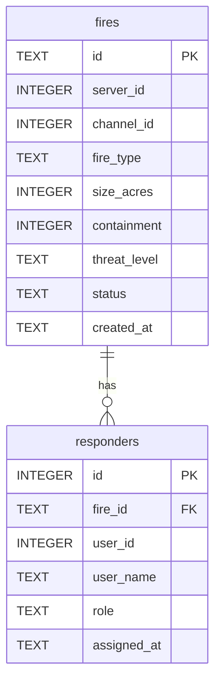

# Database Schema and Data Flow

This document outlines the SQLite database schema used by the Wildfire Bot for persistence of game state, primarily managed within `src/commands.py` by the `WildfireGame` class.

## Overview

The bot uses an SQLite database named `wildfire_game.db` to store information about ongoing and completed fire incidents and the responders assigned to them. This allows data to persist across bot restarts.

## Schema

The database consists of two main tables: `fires` and `responders`.

### 1. `fires` Table

This table stores information about each wildfire incident.

| Column         | Type    | Constraints       | Description                                         |
|----------------|---------|-------------------|-----------------------------------------------------|
| `id`           | TEXT    | PRIMARY KEY       | Unique identifier for the fire (e.g., "fire_{timestamp}"). |
| `server_id`    | INTEGER |                   | Discord server (guild) ID where the fire was created. |
| `channel_id`   | INTEGER |                   | Discord channel ID where the fire is active.        |
| `fire_type`    | TEXT    |                   | Type of fire (e.g., "grass", "forest", "interface"). |
| `size_acres`   | INTEGER |                   | Initial size of the fire in acres.                  |
| `containment`  | INTEGER |                   | Current containment percentage (0-100).             |
| `threat_level` | TEXT    |                   | Initial threat level (e.g., "low", "moderate", "high"). |
| `status`       | TEXT    |                   | Current status of the fire (e.g., "active", "contained"). |
| `created_at`   | TEXT    |                   | ISO format timestamp when the fire was created.     |

**Example Row:**

```
('fire_1678886400', 789012345678901234, 890123456789012345, 'forest', 25, 0, 'high', 'active', '2023-03-15T12:00:00.000000')
```

### 2. `responders` Table

This table tracks users who have responded to a specific fire incident.

| Column        | Type    | Constraints                        | Description                                     |
|---------------|---------|------------------------------------|-------------------------------------------------|
| `id`          | INTEGER | PRIMARY KEY AUTOINCREMENT          | Unique identifier for the responder assignment. |
| `fire_id`     | TEXT    | FOREIGN KEY (`fires`.`id`)         | ID of the fire the user responded to.           |
| `user_id`     | INTEGER |                                    | Discord user ID of the responder.               |
| `user_name`   | TEXT    |                                    | Discord display name of the responder.          |
| `role`        | TEXT    |                                    | Role assigned to the responder (e.g., "firefighter"). |
| `assigned_at` | TEXT    |                                    | ISO format timestamp when the user was assigned. |

**Example Row:**

```
(1, 'fire_1678886400', 123456789012345678, 'WildfireWarrior', 'firefighter', '2023-03-15T12:05:00.000000')
```

## Relationships

*   A **one-to-many** relationship exists between `fires` and `responders`. One fire can have multiple responders.
*   The `responders.fire_id` column links to `fires.id`.


*(A textual representation or link to a generated diagram would be ideal here. For now, this is a placeholder for a potential visual aid. Actual diagram generation is outside direct capabilities, but Mermaid.js syntax could be used if the rendering environment supports it).*


*(The above Mermaid diagram illustrates the relationship: one `fires` record can be associated with zero or more `responders` records.)*


## Data Flow

The `WildfireGame` class in `src/commands.py` handles interactions with the database.

### 1. Initialization (`WildfireGame.init_database`)

*   **Trigger**: Called when the `WildfireCommands` Cog is loaded.
*   **Action**: Connects to `wildfire_game.db`. Executes `CREATE TABLE IF NOT EXISTS` for both `fires` and `responders` tables to ensure they exist.

### 2. Creating a Fire (`WildfireGame.create_fire`)

*   **Trigger**: User executes the `/fire` command.
*   **Input**: `server_id`, `channel_id`.
*   **Action**:
    1.  Generates a unique `fire_id`.
    2.  Randomly determines `fire_type`, initial `size_acres`, and `threat_level`.
    3.  Sets `containment` to 0 and `status` to "active".
    4.  Records `created_at` timestamp.
    5.  An `INSERT` query is executed on the `fires` table with this data.
*   **Output**: Returns a dictionary with the new fire's details.

### 3. Assigning a Responder (`WildfireGame.assign_responder`)

*   **Trigger**: User executes the `/respond` command.
*   **Input**: `fire_id` (typically the first active fire found), `user_id`, `user_name`.
*   **Action**:
    1.  Records `assigned_at` timestamp.
    2.  Sets `role` (e.g., "firefighter").
    3.  An `INSERT OR IGNORE` query is executed on the `responders` table. `OR IGNORE` prevents duplicate assignments for the same user to the same fire.
*   **Output**: Returns `True` on successful assignment.

### 4. Getting Active Fires (`WildfireGame.get_active_fires`)

*   **Trigger**: User executes `/firestatus` command or system needs to update fire states.
*   **Input**: `server_id`.
*   **Action**:
    1.  A `SELECT` query retrieves all fires from the `fires` table where `server_id` matches and `status` is "active".
    2.  For each active fire:
        *   A `SELECT COUNT(*)` query on the `responders` table gets the number of responders for that `fire_id`.
        *   **Containment Update (Simplified Logic)**: Containment is progressed based on responder count (e.g., `containment = min(fire.containment + (responder_count * 10), 100)`).
        *   If `containment` reaches 100%, an `UPDATE` query changes the fire's `status` to "contained" in the `fires` table.
*   **Output**: Returns a list of dictionaries, each representing an active fire with its current details, including responder count and updated containment.

## Data Integrity and Evolution

*   **Foreign Keys**: The schema defines a foreign key constraint between `responders.fire_id` and `fires.id` to maintain relational integrity, though SQLite's enforcement of foreign keys needs to be enabled (usually is by default in modern versions).
*   **No Deletions (Current Design)**: The current logic primarily focuses on inserting and updating records. There's no explicit data deletion flow for old fires or responder assignments. This might be a consideration for future database maintenance tasks (e.g., archiving old incidents).
*   **Simplified Progression**: The containment progression logic in `get_active_fires` is a simplified representation. The full fire simulation via `FireGrid` (from `src/fire_engine.py`) is more complex and primarily in-memory for active multiplayer sessions, as detailed in `docs/multiplayer-architecture.md`. The database here seems to serve as a more persistent, summary-level store, especially for the simplified commands in `src/commands.py`.

This database structure provides a straightforward way to manage persistent game data for the bot's core features.
